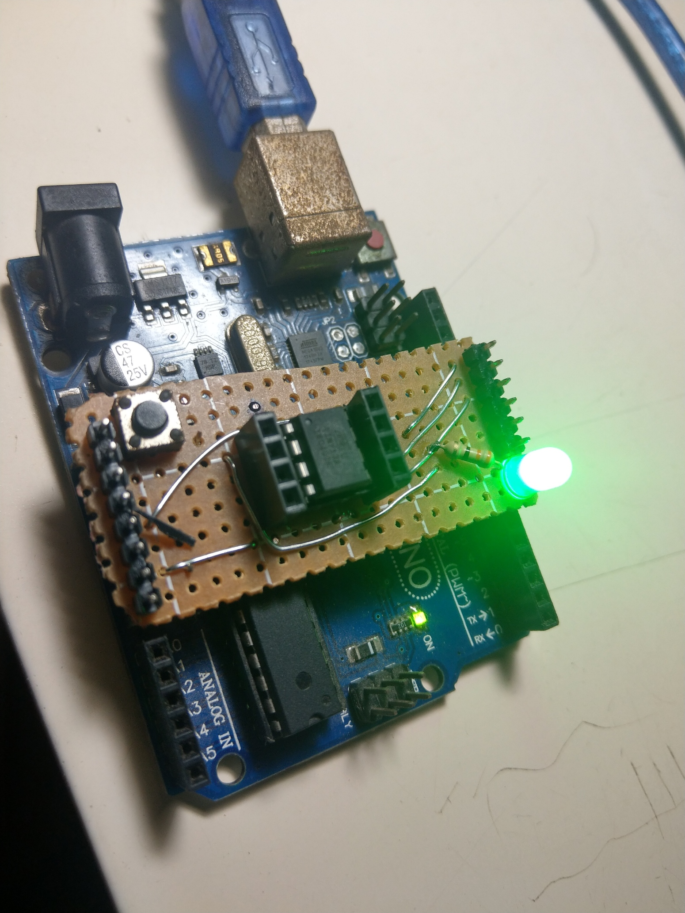

### Attiny13A using Arduino Uno as a programmer


## Step 1: upload ArduinoISP for Arduino Uno
1. Select ```File -> Examples -> ArduinoISP```
2. Select ```Tools -> Board -> Arduino Uno```
3. Upload

## Step 2: Wiring
- Plug breakout board into Arduino Uno board as following

- The Green Led Builtin is connect to pin PB0
- More detailed how to wiring above board, see in **Reference Sources**

## Step 3: Sample Attiny13A code and upload via ArduinoISP
1. Select ```Tools -> Board -> Boards manager. Find MicroCore```
2. Choose these options in Tools menu
```
Board: ATtiny 13
BOD: 4.3v
Clock: 1.2 MHz internal osc.
Compiler LTO: Enable
Port: (Your Arduino port)
Programmer: Arduino as ISP
```
3. **Upload** Example/Blink then see the result

### Reference Sources
- [Datasheet](docs/ATtiny13A.pdf)
- [MicroCore](https://github.com/MCUdude/MicroCore)
- [Electronic Basics #3: Programming an Attiny+Homemade Arduino Shield](https://www.youtube.com/watch?v=9LjfkjwMqXI)
- [Programming ATtiny13 with Arduino Uno](https://create.arduino.cc/projecthub/taunoerik/programming-attiny13-with-arduino-uno-07beba)